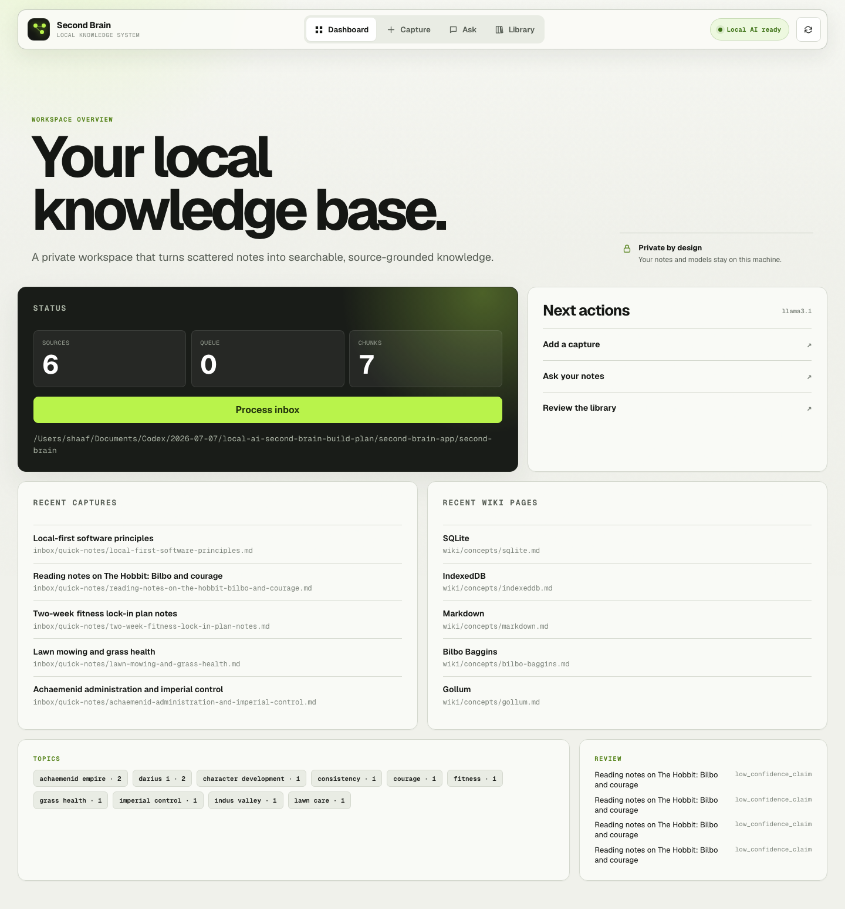
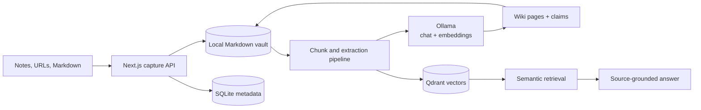
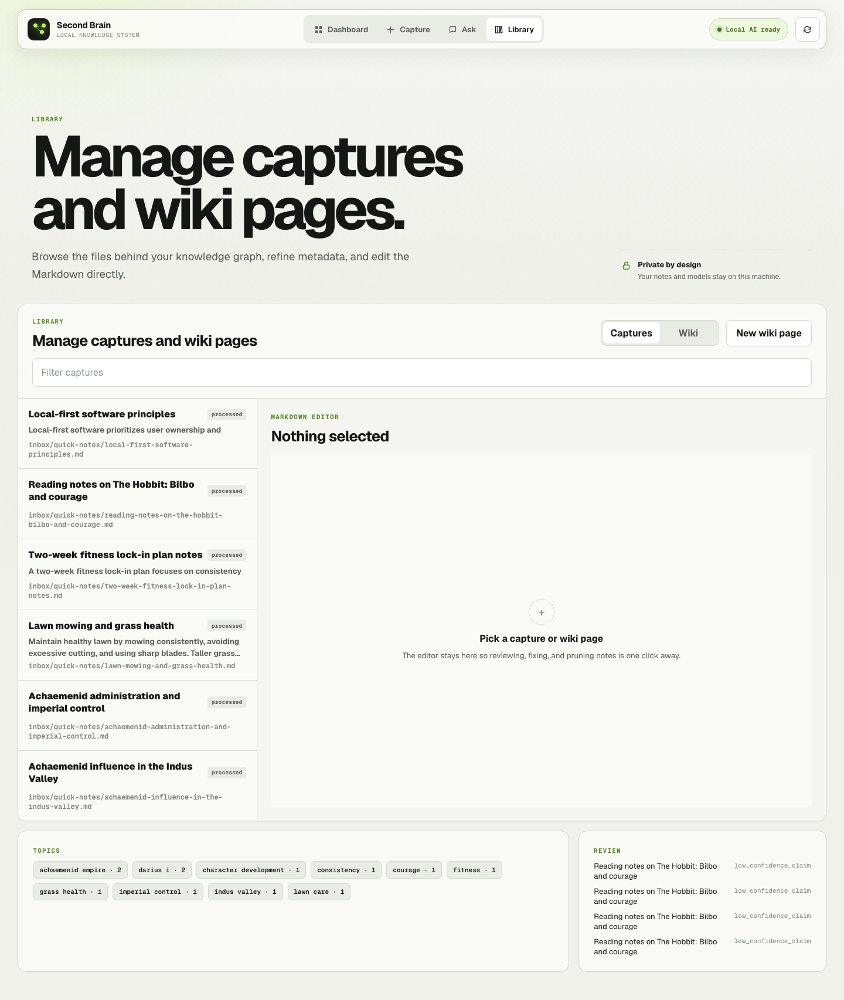

<div align="center">
  <h1>Local AI Second Brain</h1>
  <p><strong>A private knowledge workspace that turns raw notes into searchable, source-grounded answers.</strong></p>
  <p>
    Markdown is the source of truth. Ollama runs the models. Qdrant handles semantic retrieval.<br />
    Your notes stay on your machine.
  </p>
  <p>
    
    
    
    
    
  </p>
</div>



## What it does

Local AI Second Brain is an end-to-end retrieval-augmented generation app built around a durable local vault—not a chat wrapper. It captures unstructured material, extracts knowledge with local models, creates Markdown wiki pages, indexes source chunks for semantic retrieval, and answers questions with paths back to the original notes.

- **Capture without friction:** paste a note or URL, or import `.md` and `.txt` files.
- **Keep ownership:** raw captures and generated wiki pages remain ordinary Markdown files.
- **Structure locally:** extract summaries, entities, tags, and claims through Ollama.
- **Retrieve semantically:** embed and search source chunks through a local Qdrant collection.
- **Answer with provenance:** ground generated answers in retrieved snippets and retain their source paths.
- **Edit the substrate:** review captures, metadata, and generated wiki pages in the built-in Markdown library.

## Architecture



The vault is canonical. SQLite and Qdrant are rebuildable indexes, so the user's knowledge never depends on a proprietary database format.

## Run it locally

### One-command production stack

Requirements: [Docker Desktop](https://www.docker.com/products/docker-desktop/), [Ollama](https://ollama.com/), and the two local models below.

```bash
ollama pull llama3.1
ollama pull nomic-embed-text
bun run local:up
```

Open [http://localhost:3000](http://localhost:3000). The Compose stack builds the production image, starts Qdrant, and stores both the Markdown/SQLite vault and vector index in named volumes. Ports bind to `127.0.0.1` only.

```bash
bun run local:logs   # follow application logs
bun run local:down   # stop containers; keep data volumes
```

Use `SECOND_BRAIN_PORT` or `QDRANT_PORT` to override the default loopback ports. The app connects to Ollama on the host through `host.docker.internal`.

### Development mode

```bash
bun install
docker compose up -d qdrant
ollama serve
ollama pull llama3.1
ollama pull nomic-embed-text
bun run dev
```

Copy `.env.example` to `.env.local` to override vault paths, model names, or service URLs.

## Product surfaces

| Surface | Purpose |
| --- | --- |
| Dashboard | Monitor the capture queue, vector chunks, recent sources, wiki pages, review items, and topic signals. |
| Capture | Save plain text, URLs, Markdown, and text files with optional immediate processing. |
| Ask | Run semantic search or generate a local, retrieved-context answer and file it back to the wiki. |
| Library | Filter, inspect, edit, create, and delete the Markdown behind sources and wiki pages. |



## Engineering quality

The repository includes a layered verification suite rather than relying on manual demos:

- Vitest coverage across chunking, extraction, vault operations, SQLite persistence, route handlers, and React workflows.
- Playwright production-browser flows for navigation, source capture/edit/delete, and wiki create/edit/delete.
- A deployment smoke test that exercises health, capture/read/update, wiki CRUD, and cleanup against a running container.
- GitHub Actions jobs for lint, type checking, coverage, production build, Chromium E2E, and container build/smoke validation.
- A multi-stage, non-root production image with persistent `/data/vault` storage.

```bash
bun run verify
bun run test:e2e
bun run test:smoke -- http://127.0.0.1:3000
```

## Configuration

| Variable | Default | Purpose |
| --- | --- | --- |
| `SECOND_BRAIN_VAULT_DIR` | `./second-brain` | Markdown vault root. |
| `SECOND_BRAIN_DB_PATH` | `<vault>/second-brain.sqlite` | Rebuildable metadata index. |
| `OLLAMA_HOST` | `http://127.0.0.1:11434` | Local Ollama server. |
| `OLLAMA_CHAT_MODEL` | `llama3.1` | Extraction and answer model. |
| `OLLAMA_EMBEDDING_MODEL` | `nomic-embed-text` | Embedding model. |
| `QDRANT_URL` | `http://127.0.0.1:6333` | Vector database endpoint. |
| `QDRANT_COLLECTION` | `second_brain_chunks` | Vector collection name. |

The generated vault remains human-readable:

```text
second-brain/
├── inbox/
├── sources/
├── wiki/
├── maps/
├── questions/
├── logs/
├── config/
└── second-brain.sqlite
```
